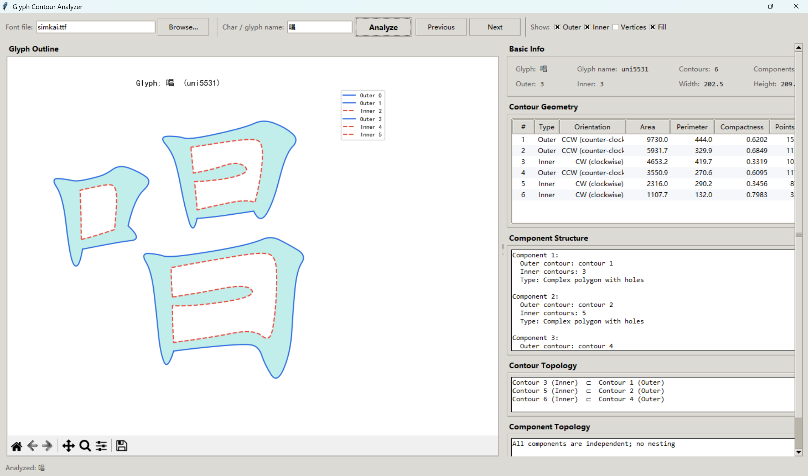

# Glyph Contour Analyzer

A graphical tool for analyzing the contour structure of glyphs in TrueType/OpenType fonts. It extracts the outline curves of glyphs from a font file, performs geometric and topological analysis, and visualizes the results.

## Features

### Visualization
- **Contour display**: Draws the outer contours (solid blue lines) and inner contours (dashed red lines) of glyphs
- **Optional vertex markers**: Toggle the display of contour vertices
- **Optional fill mode**: Semi-transparent fill showing the solid area of glyphs
- **Interactive navigation**: Built-in matplotlib toolbar for pan/zoom

### Analysis Functions
- **Basic information**: Number of contours, number of components, outer/inner contour counts, width and height of bounding box
- **Geometric features**: Area, perimeter, compactness, orientation (CW/CCW), vertex count for each contour
- **Component structure**: Groups contours into components (each outer contour plus its directly enclosed inner contours), identifying simple polygons vs. complex polygons with holes
- **Contour topology**: Nesting relationships between inner and outer contours
- **Component topology**: Nesting relationships between components (a glyph may contain multiple nested sub-components)

### Interaction
- Input any Unicode character (e.g., Chinese characters, letters) to analyze
- Previous / Next glyph navigation through the font's glyph order
- Load any `.ttf`, `.otf`, or `.ttc` font file at runtime
- Toggles for outer contours, inner contours, vertices, and fill

## Technical Stack

- **Python 3**
- **Tkinter** — graphical user interface (built into Python)
- **matplotlib** — glyph contour visualization
- **fontTools** — TrueType/OpenType font parsing and contour extraction
- **NumPy** — numerical computation (area, orientation, geometry)
- **PrecisionPen** — adaptive Bézier curve sampling for high-accuracy outline extraction

## Installation

```bash
pip install matplotlib fonttools numpy
```

> `tkinter` is included with standard Python distributions.

## Usage

```bash
python GlyphTopos.py
```

> One entry point is provided with identical functionality:
> - `GlyphTopos.py` — English UI


1. The program launches with the default `simkai.ttf` in the project directory.
2. Enter any character (e.g., "国", "回", "A") in the input box and press **Enter** or click **Analyze**.
3. Use **Previous** / **Next** to browse glyphs in the font's internal order.
4. Use **Browse...** to load a different font file.
5. Use the checkboxes to toggle outer contours, inner contours, vertex points, and the transparent fill.
6. The right panel shows: basic info, per-contour geometric features, component structure, contour topology, and component topology.

## Project Structure

```
/
├── GlyphTopos.py              Main program — English UI (GUI + analysis engine)
├── simkai.ttf                 Example font file (Kai style)
└── README.md                  English documentation
```

## Analysis Algorithm

1. **Contour extraction** — `PrecisionPen` adaptively samples each Bézier curve to form a high-precision polygon.
2. **Type correction** — Determines outer/inner contour types through the signed area and nesting depth of each polygon.
3. **Component grouping** — Groups each outer contour with the inner contours it directly encloses into one component; components whose outer contours are not enclosed by any other component are treated as independent.
4. **Topology detection** — Uses a ray-casting point-in-polygon test to determine nesting relationships, selecting the smallest enclosing contour (or component) as the direct parent.

## License

Use for learning and research purposes.
